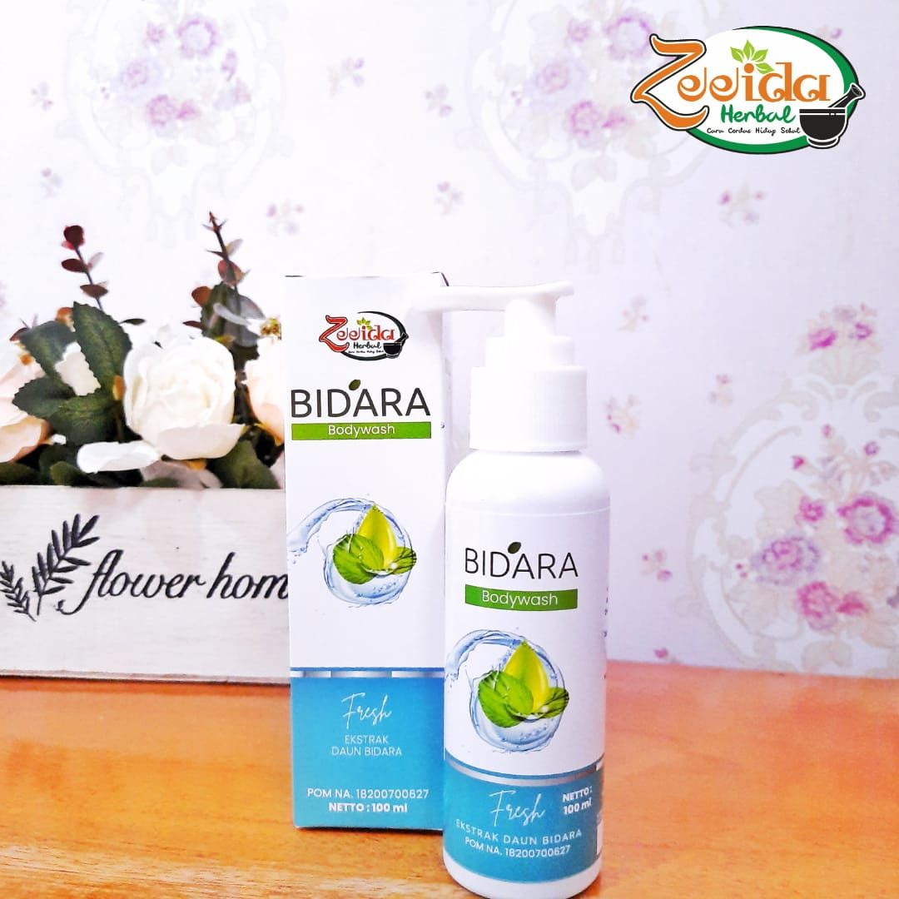
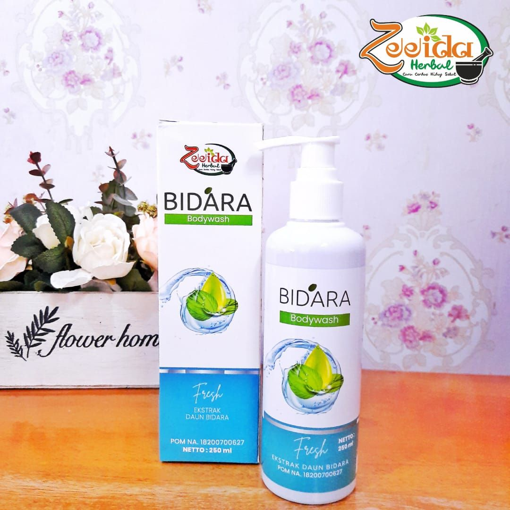
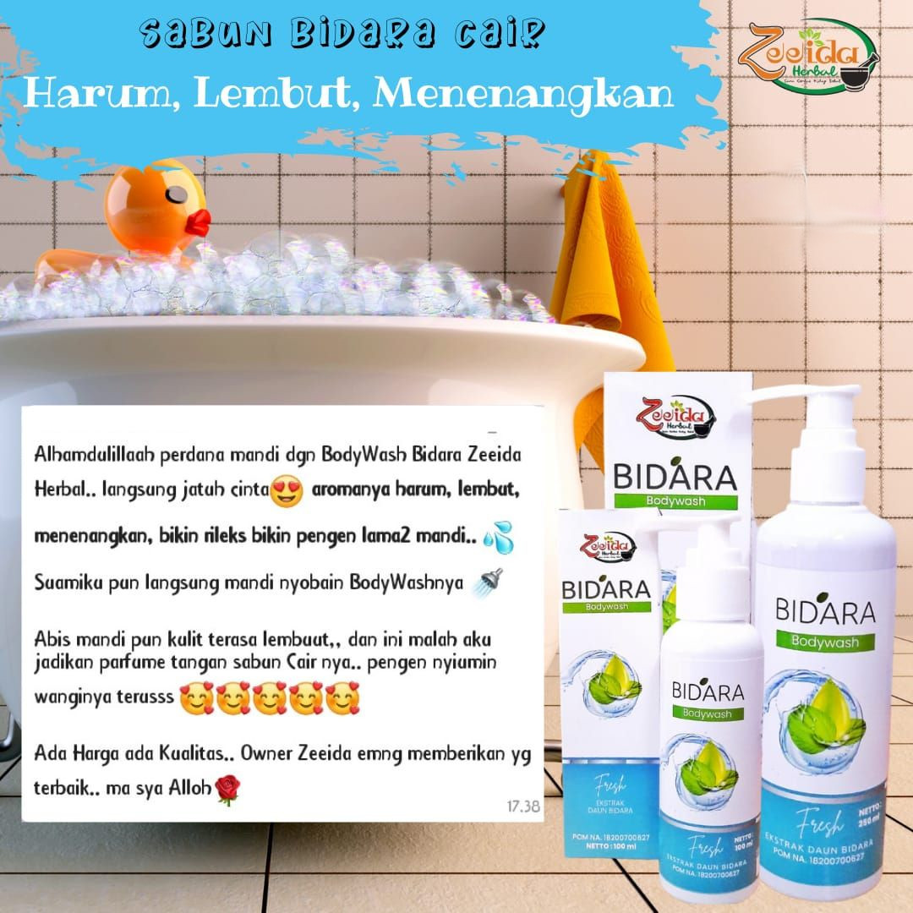
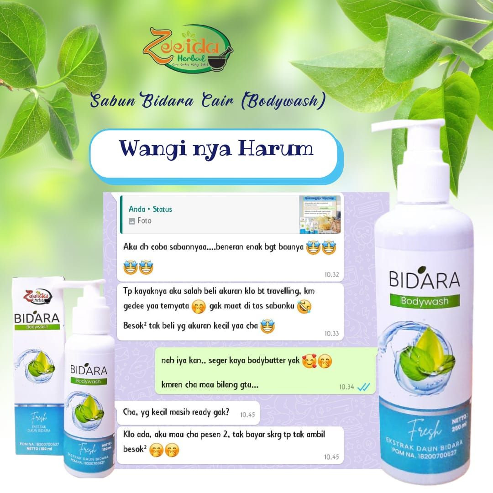
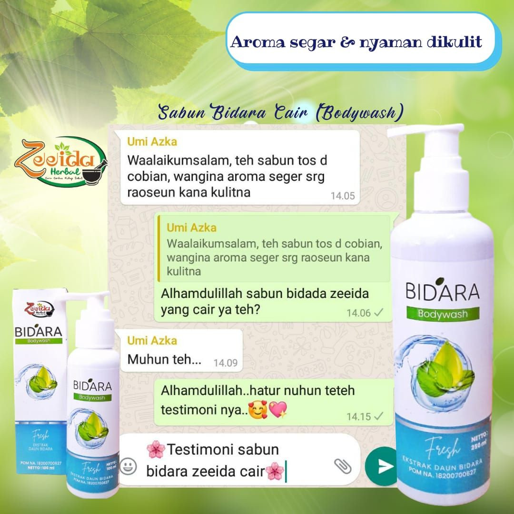
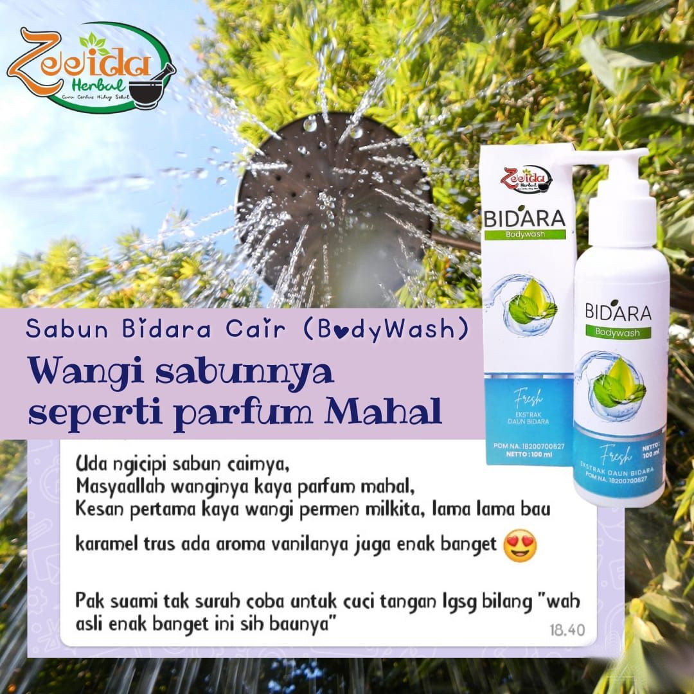

# Bidara Body Wash

## Varian & Harga

- 100 ml - Rp. 25.000,-
- 250 ml - Rp. 50.000,-

## Keterangan

### Tentang Produk

```
*BPOM NA 18200700627*

Komposisi:
Aqua, Zizyphus Spina Christi Leaf, Sodium Lauryl Sulfate, Cocamide Dea, Propylene, Glycerin, Sodium Chloride, Olive (Olea Europae) Oil, Citrid Acid, Tetra sodium Edta, fragrance, Dmdm Hydantoin. 

Aturan pakai:
Sabun mandi untuk seluruh badan. Tuangkan sedikit Bidara Body wash ke tangan atau shower pupuff, usapkan busa lembutnya ke seluruh tubuh
```

## Gambar














