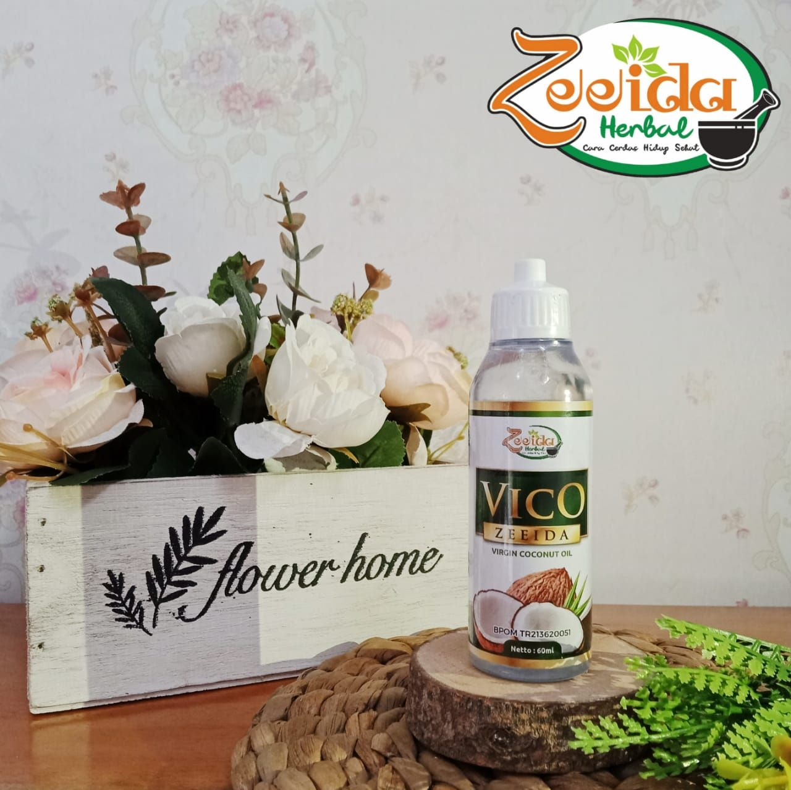
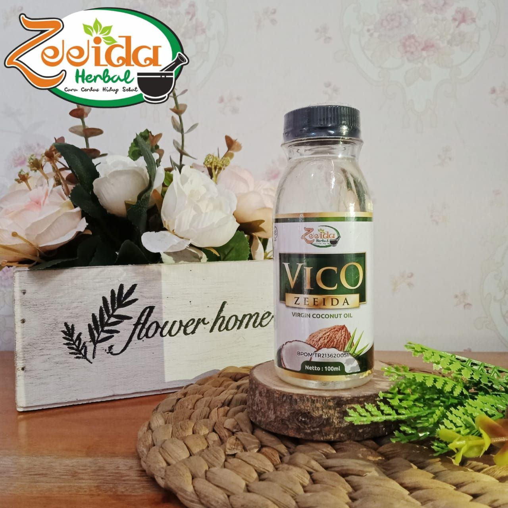
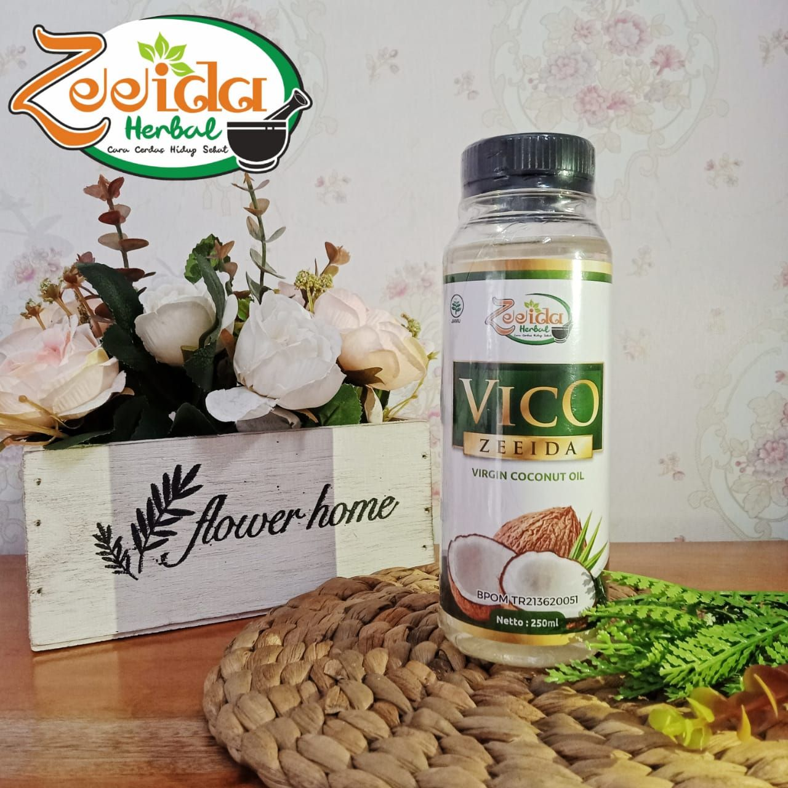
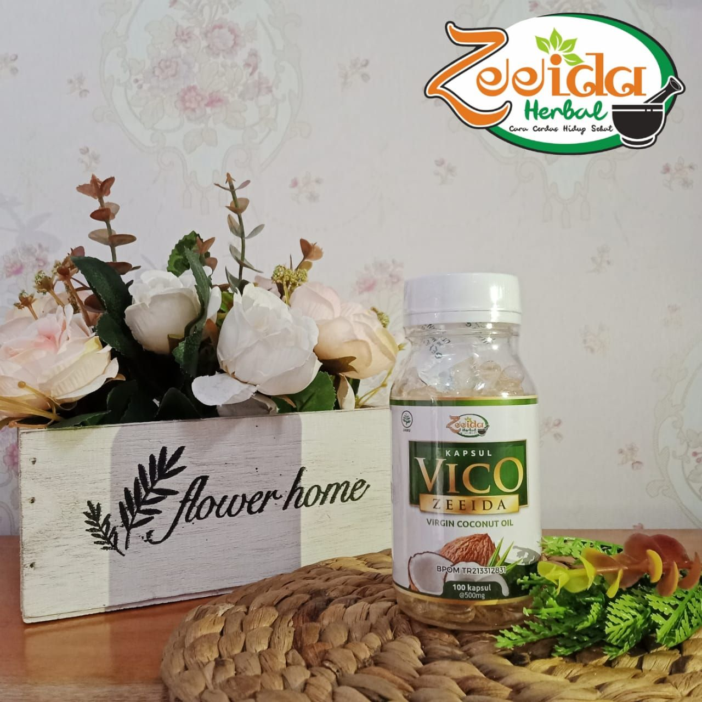

# Vico

## Varian & Harha

- Cair
     - 60 ml - Rp. 29.000,-
     - 100 ml - Rp. 39.000,-
     - 250 ml - Rp. 74.000,-

- Kapsul
     - 100 pcs - Rp. 54.000,-

## Keterangan

### Tentang Produk

```
*BPOM TR213620051*

Dengan kandungan asam laurat yg tinggi 53,1 
Membuat Vico Zeeida sangat berkualitas
Rasanya gurih  
Terasa nyaman di lidah dan di badan

Dengan kita rutin mengkonsumsi VICO Zeeida, tubuh akan menjadi lebih sehat. Khasiat VCO  yang diantaranya:
1. Mengatasi sesak nafas, asma, kelelahan
2. Menormalkan darah tinggi
3. Mematikan virus (Influenza, Hepatitis, Cacar air, Herpes, Sarkoma)
4. Mematikan bakteri (gusi berdarah, lubang pada gigi, sakit telinga, sakit tenggorokan, keracunan makanan, infeksi saluran kencing)
5. Memperbaiki system pencernakan
6. Mengatasi pembesaran prostat
7. Menormalkan kolesterol & asam urat
8. Membantu penyembuhan ambeien
9. Mencegah osteoporosis
10. Meningkatkan stamina dan daya tahan tubuh
11. Baik untuk ibu hamil dan meyusui
12. Bisa untuk untuk luka luar
13. Dapat  menghaluskan dan melembabkan kulit.

Aturan pakai ;
3-2 kapsul 3 sehari
Cair bisa dengan 2 sendok 3 kali sehari
```

## Gambar







